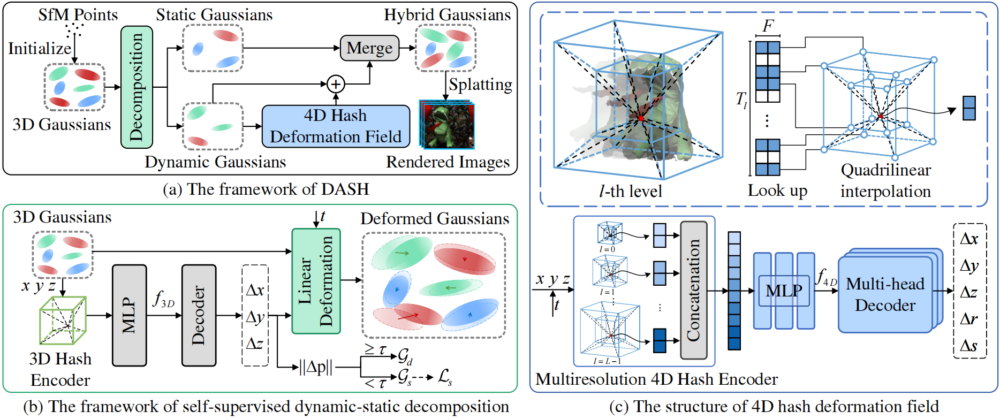

<h3 align="center"><strong>DASH: Self-Supervised Decomposition and 4D Hash Encoding

for Real-Time Dynamic Scene Rendering</strong></h3>
<p align="center">
    <a href="">Jie Chen</a>,
    <a href="">Zhangchi Hu</a>,
    <a href="">Peixi Wu</a>,
    <a href="">Huyue Zhu</a>,
    <br>
    <a href="">Hebei Li</a>,
    <a href="">Xiaoyan Sun</a>
    <br>
    University of Science and Technology of China
    <br>
    <b>ICCV 2025</b>
</p>

<div align="center">
 <a href=''></a> &nbsp;&nbsp;&nbsp;&nbsp;&nbsp;
 <a href='https://github.com/chenj02/DASH/blob/main/LICENSE'></a> &nbsp;&nbsp;&nbsp;&nbsp;&nbsp;
 <br>
 <br>
</div>

<p align="center">

</p>

## Quick Start

### Dataset Preparation
To train DASH, you should download the following dataset:
+ Neural 3D Video Dataset
+ Technicolor dataset
We follows [4D-GS](https://github.com/hustvl/4DGaussians) for preprocessing the Neural 3D Video dataset, and [STGS](https://github.com/oppo-us-research/SpacetimeGaussians) for the Technicolor dataset. Thanks very much for their excellent work.

### Installation

```shell
git clone https://github.com/chenj02/DASH.git
cd DASH

conda env create -f environment.yaml
conda activate DASH

pip install -e ./submodules/diff=gaussian-rasterization
pip install -e ./submodules/simple-knn
```

### Training

```shell
bash train.sh
```
or
```shell
CUDA_VISIBLE_DEVICES=0 python train.py -s <input path> \
                --model_path <output path> \
                --conf <config path> \
                --resolution 1 # for Technicolor dataset
```
### Render

```shell
bash render.sh
```
or

```shell
CUDA_VISIBLE_DEVICES=0 python render.py -s <input path> \
                --skip_train \
                --model_path <output path> \
                --conf <config path> \
                --resolution 1 # for Technicolor dataset
```

### Evaluation

```shell
python metrics.py -m <output path>
```

### Citation

If you find our work useful, please cite:

```bibtex
@inproceedings{chen2025dash,
    title={DASH: Self-Supervised Decomposition and 4D Hash Encoding for Real-Time Dynamic Scene Rendering}, 
    author={Chen, Jie and Hu, Zhangchi and Wu, Peixi and Zhu, Huyue and Li, Hebei and Sun, Xiaoyan}, 
    booktitle = {International Conference on Computer Vision (ICCV)},
    year={2025}
}
```

### Acknowledgements
Our code is based on [4D-GS](https://github.com/hustvl/4DGaussians) and [Grid4D](https://github.com/JiaweiXu8/Grid4D). We thank the authors for their excellent work!